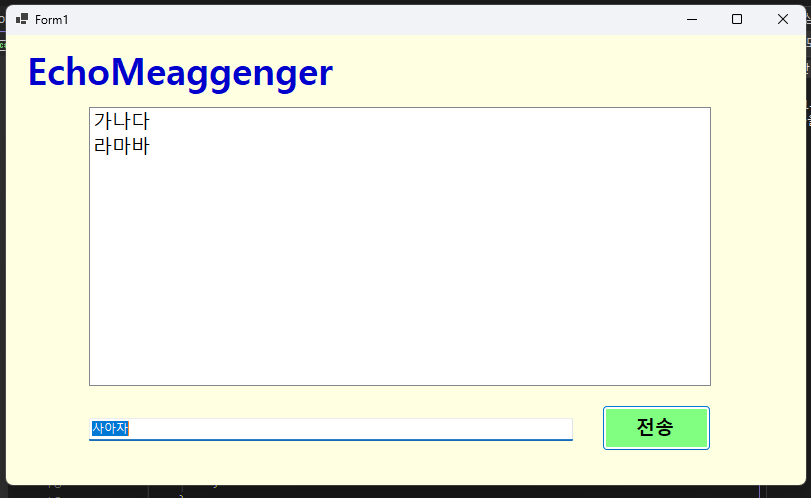
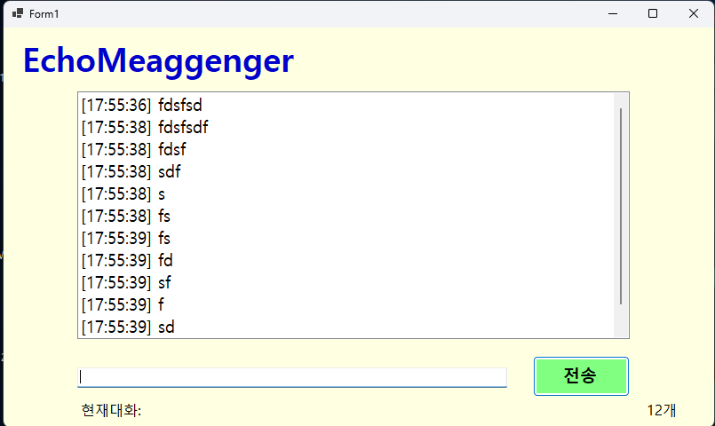
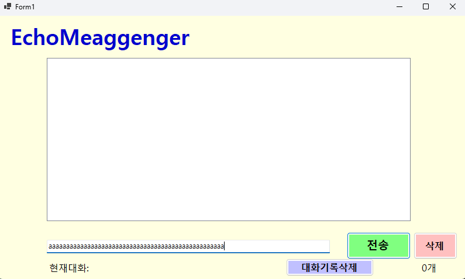

# (C# 코딩) 에코메신저## 개요
-C# 프로그래밍학습

-핵심기능: TextBox에 입력된 문자를 listBox에 추가하는 기능, textBox에 입력된 문자를 listBox에서 삭제하는기능, textBox에 입력된 문자를 listBox에서수정하는기능,좌클릭 혹은 엔터를 통해서 textbox에 입력된 문자를 listbox에 올림

-화면구성: Form : 프로그램전체윈도우창, Label : 화면에표시되는문자열, TextBox: 키보드 타이핑이 가능한 입력창, ListBox: 여러개의 항목을 리스트로 보여주고, 선택 할 수 있는 창, button : 클릭이 가능한 버튼

## 실행화면

## 실행화면(과제1)-과제1 코드의 실행 스크린샷

 

 -과제 내용
	 -컨트롤배치와기본적인속성(Text, Items) 제어

 -구현 내용과 기능 설명
	-textBox에 문자를 입력하고, 버튼을 클릭하면 listBox에 문자가 추가되고 textBox에 입력된 문자가 삭제됩니다.

## 실행화면(과제2)-과제2 코드의 실행 스크린샷

-과제내용
	-메서드와조건문을활용한편의기능구현

-구현 내용과 기능 설명
	-textBox에 문자를 입력하고, 버튼을 클릭뿐만 아니라 엔터를 쳐도 listBox에 문자가 추가 되며 공백만 보내면 전송이 되지 않습니다.

## 실행화면(과제3)-과제3 코드의 실행 스크린샷

-과제내용
	-문자열처리(String) 및속성결합활용

-구현 내용과 기능 설명
	-textBox에 문자를 입력하면 왼쪽에 시간이 표시되며 대화의 갯수를 세어서 대화의 갯수도 표시됩니다.

## 실행화면(과제4)-과제4 코드의 실행 스크린샷

-과제내용
	-컬렉션제어(Remove) 및시스템연동

-구현 내용과 기능 설명
	-ListBox에서특정메시지를 마우스로 클릭하고'삭제' 버튼을 누르면 행당하는 메시지가 삭제됩니다. 대화기록 삭제를 눌러 모든 대화 기록을 삭제합니다. 입력창의 문자를 50자 이상 입력하면 글자가 더 이상 쳐지지 않게 차단됩니다

## 배운내용
-전에 배운 다양한 도구들을 사용하여 살짝 헷갈렸지만 코딩은 Copilot의 도움으로 어렵지 않게 할 수 있었으며 사람이 볼 때에 대문자, 소문자, 공백은 구분을 잘 안하지만 컴퓨터는 공백 하나라도 있으면 다르게 인식한다는 것을 새롭게 배우게 되었습니다.
